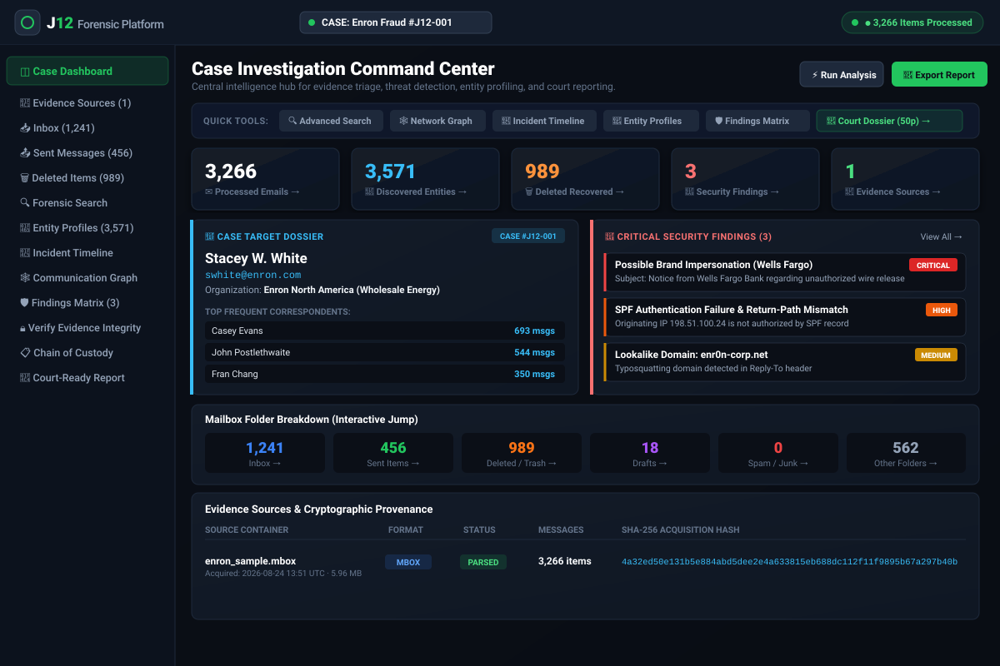
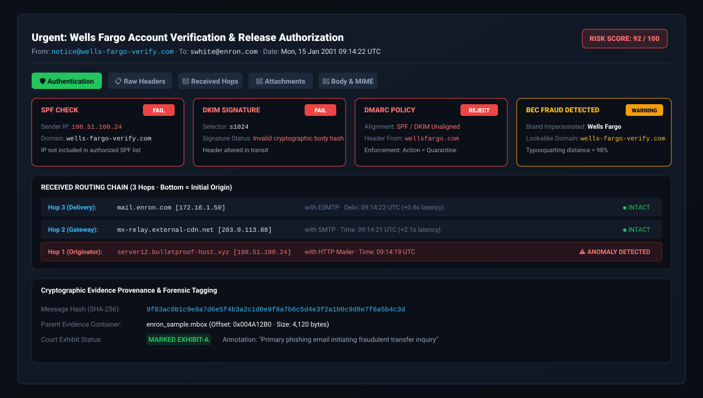
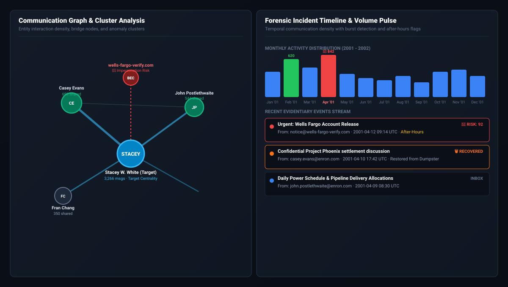

<div align="center">


# <span style="color:#ffffff;">J</span><span style="color:#22c55e;">12</span> Email Forensic Suite
### **Advanced Desktop Email Investigation & eDiscovery Intelligence Platform**

[]()
[]()
[]()
[]()
[]()

**Forensic-grade evidence provenance · Tamper-evident cryptographic verification · Court-admissible dossiers**

*Every conclusion traces directly to raw evidence bytes.*

---

</div>

## 🎯 Executive Overview

**<span style="color:#ffffff;">J</span><span style="color:#22c55e;">12</span>** is a court-admissible, multi-user desktop email forensic investigation and eDiscovery platform. Built for digital forensic examiners, incident responders, corporate fraud investigators, and law enforcement agencies, **J12** delivers high-performance parsing of massive digital mail containers (`MBOX`, `PST`, `OST`, `EML`, `MSG`, `EMLX`) with instant cryptographic provenance.

> **⚖️ Legal Defensibility & Standards:**
> While no software can make evidence automatically "admissible," **J12** enforces rigorous **ISO/IEC 27037**, **SWGDE digital evidence protocols**, and **Daubert / FRE 702** standards. Every extracted header, timestamp, and body snippet maintains an immutable cryptographic trace:
> $$\text{Field} \longrightarrow \text{Raw Bytes} \longrightarrow \text{Container Offset} \longrightarrow \text{SHA-256 Hash} \longrightarrow \text{Custody Audit Log}$$

---

## 🖥️ Live Platform Architecture & Previews

### 1. Case Investigation Command Center
The central investigation dashboard provides immediate situational awareness, target subject profiling, interactive KPI drilldowns, and active BEC/spoofing threat alerts.

<div align="center">
  
</div>

---

### 2. Forensic Header & Authentication Inspector
Comprehensive cryptographic verification of email transmission headers, SPF/DKIM/DMARC alignment, received hops latency tracking, and brand impersonation detection.

<div align="center">
  
</div>

---

### 3. Communication Network Graph & Chronological Timeline Feed
Interactive sociometric network clustering, entity alias disambiguation (Exchange DN resolving), burst traffic anomaly detection, and after-hours communication heatmaps.

<div align="center">
  
</div>

---

## ⚡ Key Forensic Capabilities

| Capability | Technical Implementation | Forensic Benefit |
| :--- | :--- | :--- |
| **Container Ingestion** | Streaming zero-copy Rust parsers (`mbox`, `pst`, `eml`, `msg`) | Ingest millions of messages with low memory footprint and zero byte corruption. |
| **Cryptographic Integrity** | On-the-fly **SHA-256** & **SHA-512** container and message hashing | Instant verification against tampering; satisfies strict chain of custody. |
| **Authentication Engine** | SPF, DKIM signature verification, DMARC alignment, ARC seals | Identifies spoofed headers, open relays, and malicious relay injection. |
| **BEC & Fraud Detection** | Levenshtein domain distance, lookalike/typosquatting detection | Flags sophisticated CEO fraud and wire redirect schemes before escalation. |
| **Entity Disambiguation** | Clean name normalization & Exchange DN alias resolution | Unifies messy LDAP paths (e.g. `/O=ENRON/OU=NA/CN=RECIPIENTS/CN=Swhite`) into canonical profiles. |
| **Temporal Stream** | Granular Monthly/Daily histogram buckets & non-inverted vertical feed | Pinpoints burst anomalies, weekend spikes, and communication blackout periods. |
| **Court-Ready Dossier** | Comprehensive multi-chapter Belkasoft / Oxygen style reporting | Generates 50+ page audit reports with sworn examiner certification and exhibits. |

---

## 📂 Multi-Chapter Forensic Reporting

**<span style="color:#ffffff;">J</span><span style="color:#22c55e;">12</span>** exports exhaustive, formal forensic reports formatted for court submission, regulatory inquiry, and internal board presentations:

1. **Case Overview & Legal Privilege Metadata**: Agency markings, case file reference, examiner ID, and target subject dossier.
2. **Evidence Sources & Provenance**: Container physical format, byte size, message tallies, and verifiable SHA-256 acquisition hashes.
3. **Executive Analytics & Volume Ledger**: Message directionality (Inbound, Outbound, Deleted/Recovered).
4. **Mailbox Folder Breakdown**: Itemized folder tally (Inbox, Sent Items, Dumpster, Drafts, Spam, Other) with date bounds.
5. **Security Findings & Tampering Matrix**: Detailed technical breakdown of critical BEC, SPF/DKIM failures, and spoofing incidents.
6. **Target Subject Dossier & Top 30 Correspondents**: Centrality rankings, alias maps, and conversation distribution.
7. **Evidentiary Flagged Messages Ledger**: Chronological table of suspicious, high-risk, and recovered deleted messages.
8. **Extracted Attachments Manifest**: File artifact inventory with MIME types, file sizes in KB, and SHA-256 hashes.
9. **Marked Evidentiary Exhibits**: Formally bookmarked evidence with examiner notes and annotations.
10. **Chain of Custody & Audit Log**: Immutable record of evidence transfers, verification events, and tools used.
11. **Sworn Forensic Examiner Certification**: ISO/IEC 27037 compliance declaration with legal signature blocks.

---

## 🛠️ Technology Stack

```
┌───────────────────────────────────────────────────────────────────────┐
│                    INVESTIGATOR INTERFACE (DESKTOP)                   │
│          React 18 · TypeScript · Vite · Vanilla Responsive CSS        │
├───────────────────────────────────────────────────────────────────────┤
│                   TAURI 2.x DESKTOP IPC BRIDGE                        │
│          Hardware acceleration · Native system dialogs · Secure IPC   │
├───────────────────────────────────────────────────────────────────────┤
│                      RUST FORENSIC ENGINE CORE                        │
│  Parser Registry · MIME Decoder · Auth Verifier · Entity Resolution  │
├───────────────────────────────────────────────────────────────────────┤
│                     EVIDENCE REPOSITORY & STORE                       │
│    SQLite (WAL mode) · Content-Addressable Storage · SHA-256 Manifest │
└───────────────────────────────────────────────────────────────────────┘
```

- **Frontend**: React 18.3, TypeScript, Vite 6, Custom forensic design system
- **Backend Core**: Rust (Tauri 2.x, `rusqlite`, `sha2`, `chrono`, `serde`)
- **Database**: SQLite with WAL (Write-Ahead Logging) and indexed full-text search tokens
- **Supported Platforms**: macOS (Apple Silicon & Intel), Windows 10/11 (x64), Linux (x86_64)

---

## 🚀 Quick Start & Installation

### Prerequisites
- **Node.js**: v18.0 or higher
- **Rust**: v1.75 or higher (`cargo`, `rustc`)
- **Build Tools**: Xcode CLI Tools (macOS) or Visual Studio C++ Build Tools (Windows)

### Installation Steps

1. **Clone the repository:**
   ```bash
   git clone https://github.com/your-org/email-forensic.git
   cd email-forensic/email-forensic-desktop
   ```

2. **Install Node dependencies:**
   ```bash
   npm install
   ```

3. **Run the desktop application in development mode:**
   ```bash
   npx tauri dev
   ```

4. **Build production binaries:**
   ```bash
   npm run tauri build
   ```

---

## 🔒 Security & Privacy

- **100% Air-Gapped Capable**: Operates completely offline without sending evidence data or telemetry to external servers.
- **Read-Only Preservation**: Evidence sources are opened strictly in read-only mode (`O_RDONLY`), preventing accidental modification.
- **Role-Based Access Control**: Multi-user credentials with bcrypt hashing and session protection.

---

## 📜 License

This project is licensed under the **MIT License**. See the `LICENSE` file for details.

<div align="center">

**<span style="color:#ffffff;">J</span><span style="color:#22c55e;">12</span> Forensic Platform** · Built for Digital Investigators &amp; eDiscovery Examiners

</div>
