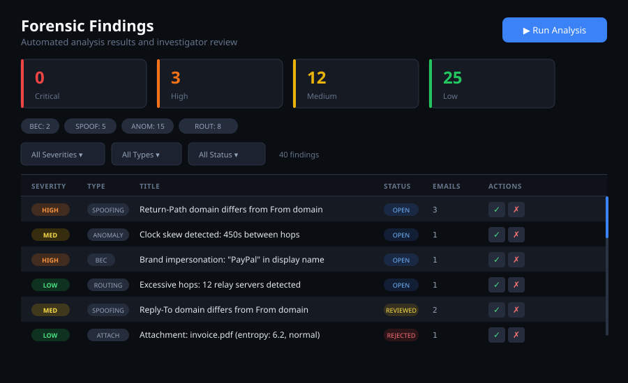

<div align="center">


# <span style="color:#ffffff;">J</span><span style="color:#22c55e;">12</span> Email Forensic Suite
### **Advanced Desktop Email Investigation, Artifact Carving & eDiscovery Intelligence Platform**

[]()
[]()
[]()
[]()
[]()
[]()

**Forensic-grade evidence provenance · Tamper-evident cryptographic verification · Court-admissible dossiers**

[⭐ Star This Project on GitHub](https://github.com/iampopg/J12) · [Report Issue / Feedback](https://github.com/iampopg/J12/issues) · Created with precision by [@iampopg](https://github.com/iampopg)

---

</div>

## 🎯 Executive Overview

**<span style="color:#ffffff;">J</span><span style="color:#22c55e;">12</span>** is a court-admissible, multi-user desktop email forensic investigation and eDiscovery platform. Built for digital forensic examiners, incident responders, corporate fraud investigators, and law enforcement agencies, **J12** delivers high-performance parsing of massive digital mail containers (`MBOX`, `PST`, `OST`, `EML`, `MSG`, `EMLX`) and live IMAP mailboxes with instant cryptographic provenance.

> **⚖️ Legal Defensibility & Standards:**
> While no software can make evidence automatically "admissible," **J12** enforces rigorous **ISO/IEC 27037**, **NIST SP 800-86**, **SWGDE digital evidence protocols**, and **Daubert / FRE 702** standards. Every extracted header, timestamp, and body snippet maintains an immutable cryptographic trace:
> $$\text{Field} \longrightarrow \text{Raw Bytes} \longrightarrow \text{Container Offset} \longrightarrow \text{SHA-256 Hash} \longrightarrow \text{Custody Audit Log}$$

---

## 🖥️ Live Platform Architecture & Previews

### 1. Case Investigation Command Center & Dashboard
The central investigation dashboard provides immediate situational awareness, target subject profiling, interactive KPI drilldowns, evidence container tallies, and active BEC/spoofing threat alerts.

<div align="center">
  
</div>

---

### 2. Forensic Header & Authentication Inspector
Comprehensive cryptographic verification of email transmission headers, SPF/DKIM/DMARC alignment, received hops latency tracking, ARC validation, and brand impersonation detection.

<div align="center">
  
</div>

---

### 3. Communication Network Graph & Chronological Timeline Feed
Interactive sociometric network clustering, entity alias disambiguation (Exchange DN resolving), burst traffic anomaly detection, and after-hours communication heatmaps.

<div align="center">
  
</div>

---

### 4. Forensic Security Violations & Risk Matrix
Real-time threat engine surfacing spoofing attempts, lookalike sender anomalies, high-entropy attachment warnings, and cryptocurrency extortion triggers.

<div align="center">
  
</div>

---

## ⚡ Core Forensic Capabilities

| Capability | Technical Implementation | Forensic Benefit |
| :--- | :--- | :--- |
| **Container Ingestion** | Streaming zero-copy Rust parsers (`mbox`, `pst`, `eml`, `msg`, `emlx`) | Ingest millions of messages with low memory footprint and zero byte corruption. |
| **Live IMAP Acquisition** | Native TLS 1.3 streaming client with folder auto-discovery & deduplication | Acquire remote cloud mailboxes (Gmail, Outlook, Yahoo, Corporate IMAP) forensically over wire. |
| **24-Domain Artifact Hub** | Belkasoft / Oxygen style regex & cryptographic entity extraction | Instantly surfaces credentials, API keys, crypto wallets, banking IBANs, and cloud storage links. |
| **Cryptographic Bitcoin Checksum** | Double SHA-256 (`SHA256(SHA256(payload))[0..4]`) Base58Check verification | Eliminates 100% of tracking ID false positives from newsletters and tracking pixels. |
| **Header & Auth Inspector** | SPF, DKIM signature verification, DMARC alignment, ARC seals, relay hops | Identifies spoofed headers, open relays, and malicious relay injection. |
| **BEC & Lookalike Detection** | Levenshtein domain distance & typosquatting detection | Flags CEO fraud and wire redirect schemes before escalation. |
| **Attachment Forensic Scanner** | Magic-byte signature classification, Shannon entropy & macro detection | Identifies hidden executables, obfuscated payloads, and encrypted archives. |
| **Communication Graph & Timeline** | Sociometric network clustering, entity alias resolution & hour heatmaps | Unifies Exchange DN aliases and pinpoints after-hours anomaly bursts. |
| **Court-Ready Dossier** | Multi-chapter formal reporting with high-contrast print `@media print` CSS | Exports standalone self-contained HTML dossiers and prints sworn examiner audit packets. |

---

## 🧩 24-Domain Forensic Artifact Taxonomy

**J12** includes a real-time forensic scanning engine categorizing critical evidence into 24 distinct domains:

1. 🔑 **Credentials & Passwords** *(API tokens, bearer keys, database URLs, SMTP passwords)*
2. 🪙 **Cryptocurrency & Wallets** *(Base58Check-verified Bitcoin addresses, Ethereum, Monero, recovery seeds)*
3. 💳 **Financial & Banking** *(Credit card PANs with Luhn check, IBANs, SWIFT/BIC, wire routing)*
4. 💬 **Chat & Messengers** *(WhatsApp, Telegram, Discord, Signal, Slack, Teams invites & logs)*
5. 🌐 **Social Media & Tracking** *(Facebook, Twitter/X, Instagram, LinkedIn, TikTok profiles & tokens)*
6. ☁️ **Cloud Storage & Sync** *(Google Drive, Dropbox, OneDrive, Mega, Box, AWS S3 transfer URLs)*
7. 🖥️ **Remote Access & Desktop** *(AnyDesk, TeamViewer, RustDesk, RDP credentials & session links)*
8. 🛡️ **VPN & Privacy Services** *(Tor, NordVPN, ExpressVPN, Proton, Shadowsocks configs)*
9. 🛒 **E-Commerce & Receipts** *(Amazon, eBay, Shopify, PayPal, Stripe transaction receipts)*
10. ✈️ **Travel & Geolocation** *(Flight bookings, Uber/Lyft receipts, hotel itineraries, GPS coordinates)*
11. 🏢 **Corporate & ERP** *(Salesforce, Jira, GitHub, GitLab, Okta, Workday access)*
12. 🚨 **Threat IOCs** *(Malicious IPs, suspicious domains, dynamic DNS, phishing URLs)*

---

## 📂 Multi-Chapter Court-Ready Forensic Reporting

**<span style="color:#ffffff;">J</span><span style="color:#22c55e;">12</span>** exports exhaustive, formal forensic dossiers formatted for court submission, regulatory inquiry, and internal board presentations:

1. **Case Overview & Legal Privilege Metadata**: Agency markings, case file reference, examiner ID, and target subject dossier.
2. **Evidence Sources & Provenance**: Container physical format, byte size, message tallies, and verifiable SHA-256 acquisition hashes.
3. **Executive Analytics & Volume Ledger**: Message directionality (Inbound, Outbound, Deleted/Recovered).
4. **Mailbox Folder Breakdown**: Itemized folder tally (Inbox, Important, Sent Items, Dumpster, Drafts, Spam, Other) with date bounds.
5. **Security Findings & Tampering Matrix**: Detailed technical breakdown of critical BEC, SPF/DKIM failures, and spoofing incidents.
6. **Target Subject Dossier & Top Correspondents**: Centrality rankings, alias maps, and conversation distribution.
7. **Evidentiary Flagged Messages Ledger**: Chronological table of suspicious, high-risk, and recovered deleted messages.
8. **Extracted Attachments Manifest**: File artifact inventory with MIME types, file sizes in KB, and SHA-256 hashes.
9. **Marked Evidentiary Exhibits**: Formally bookmarked evidence with examiner notes and annotations.
10. **Chain of Custody & Audit Log**: Immutable record of evidence transfers, verification events, and tools used.
11. **Sworn Forensic Examiner Certification**: ISO/IEC 27037 compliance declaration with legal signature blocks.

---

## 🛠️ Technology Stack

```
┌───────────────────────────────────────────────────────────────────────┐
│                    INVESTIGATOR INTERFACE (DESKTOP)                   │
│          React 18 · TypeScript · Vite · Vanilla Responsive CSS        │
├───────────────────────────────────────────────────────────────────────┤
│                   TAURI 2.x DESKTOP IPC BRIDGE                        │
│          Hardware acceleration · Native system dialogs · Secure IPC   │
├───────────────────────────────────────────────────────────────────────┤
│                      RUST FORENSIC ENGINE CORE                        │
│  Parser Registry · MIME Decoder · Auth Verifier · Entity Resolution  │
├───────────────────────────────────────────────────────────────────────┤
│                     EVIDENCE REPOSITORY & STORE                       │
│    SQLite (WAL mode) · Content-Addressable Storage · SHA-256 Manifest │
└───────────────────────────────────────────────────────────────────────┘
```

- **Frontend**: React 18.3, TypeScript, Vite 6, Custom responsive forensic design system
- **Backend Core**: Rust (Tauri 2.x, `rusqlite`, `sha2`, `chrono`, `serde`, `native-tls`)
- **Database**: SQLite with WAL (Write-Ahead Logging) and indexed full-text search tokens
- **Supported Platforms**: macOS (Apple Silicon & Intel), Windows 10/11 (x64), Linux (x86_64)

---

## 🚀 Quick Start & Installation

### Prerequisites
- **Node.js**: v18.0 or higher
- **Rust**: v1.75 or higher (`cargo`, `rustc`)
- **Build Tools**: Xcode CLI Tools (macOS) or Visual Studio C++ Build Tools (Windows)

### Installation Steps

1. **Clone the repository:**
   ```bash
   git clone https://github.com/iampopg/J12.git
   cd J12
   ```

2. **Install Node dependencies:**
   ```bash
   npm install
   ```

3. **Run in development mode:**
   ```bash
   npm run tauri dev
   ```

4. **Build production binaries:**
   ```bash
   npm run tauri build
   ```

---

## 🔒 Security & Privacy

- **100% Air-Gapped Capable**: Operates completely offline without sending evidence data or telemetry to external servers.
- **Read-Only Preservation**: Evidence sources are opened strictly in read-only mode (`O_RDONLY`), preventing accidental modification.
- **Accidental Deletion Protection**: All case and evidence deletion actions require explicit typed `DELETE` confirmation.
- **Local Multi-User Auth**: Local credential management with compliance agreement guards.

---

## 👤 Author & Contribution

Developed with precision by **[@iampopg](https://github.com/iampopg)**.

If you find this project valuable for your digital investigations or eDiscovery workflows, please **[⭐ Star this repository on GitHub](https://github.com/iampopg/J12)**!

---

## 📜 License

This project is open-source software licensed under the [MIT License](LICENSE).
